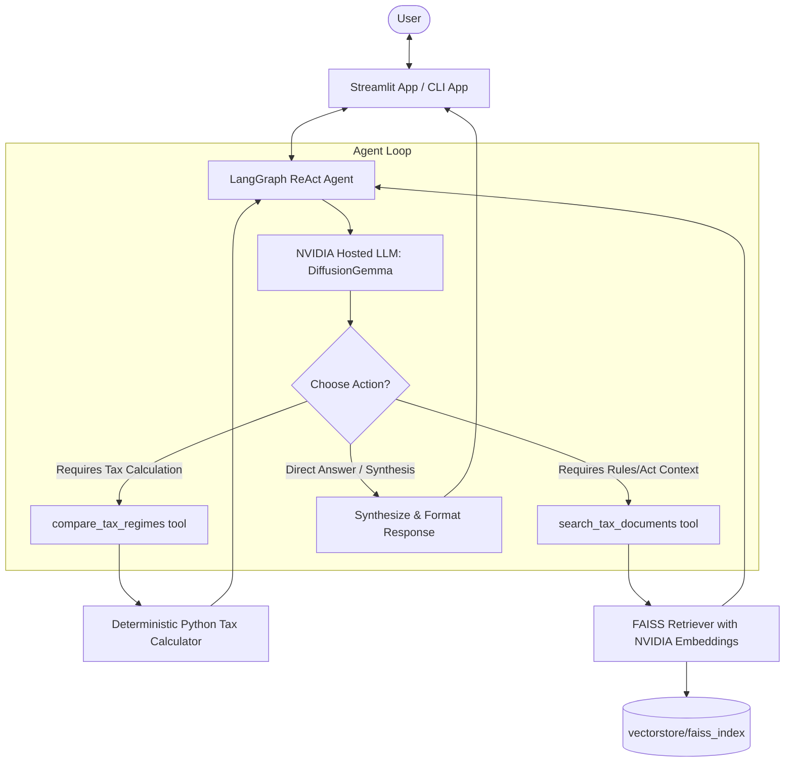
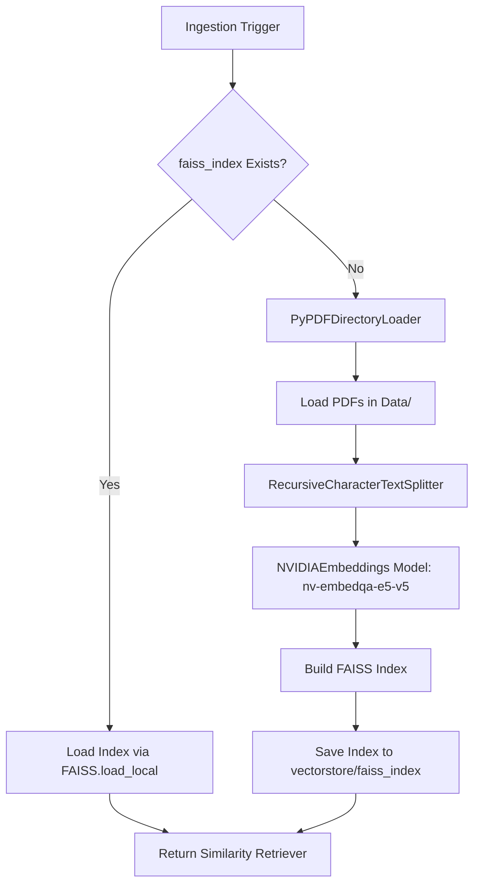

# 🤖 FinPilot AI — System Technical Documentation & Concept Primer

Welcome to the comprehensive technical documentation and conceptual primer for **FinPilot AI**, an end-to-end AI-powered Tax Planning Assistant. This document contains both high-level conceptual definitions for educational purposes and exhaustive technical implementation details of the agent's software components.

FinPilot AI helps users navigate Indian Income Tax rules, estimate tax liabilities under both the Old and New tax regimes (FY 2024-25), compute HRA and other deductions, and answer general tax queries.

Unlike a typical LLM chatbot, **FinPilot AI** is built as an **AI Agent**. It uses a **Reasoning and Action (ReAct)** loop powered by LangGraph, coordinating between a semantic document search system (RAG) and deterministic calculations written in pure Python.

---

## 📖 Conceptual Glossary & Definitions

Understanding the core building blocks of modern AI agent architectures:

### 1. What is an AI Agent?
An **AI Agent** is an autonomous software system powered by a foundation model (LLM) that can perceive its environment, make decisions, invoke external tools, retrieve information, and carry out tasks.
* **Traditional Chatbot**: Simply feeds your text prompt to an LLM, generating a text response from the model's static pre-trained weights.
* **AI Agent**: Analyzes the query, decides *how* to answer it, selects external tools (such as search databases or API clients), runs them, receives the tools' inputs, and synthesizes a final output.

```
Traditional Chatbot:  User ──> LLM ──> Response
AI Agent:             User ──> LLM ──> Choose Tool ──> Run Python Tool ──> LLM ──> Response
```

### 2. What is LangGraph?
**LangGraph** is an orchestration framework designed for building stateful, multi-agent systems using graph structures (nodes and edges).
* Think of LangGraph as the **nervous system** of the agent.
* It manages the conversational memory (state), routes control logic between the LLM and registered tools, handles loops (e.g. running multiple tools in sequence), and produces structured execution steps.

### 3. What is a Large Language Model (LLM)?
A **Large Language Model (LLM)** is a neural network model trained on huge textual corpuses to understand and produce natural language. In an agentic architecture:
* The LLM does **not** do math or store static tax formulas.
* Instead, it serves as the **reasoning engine** that determines intent, parses variables, reads tool definitions, decides whether to run a tool, and translates code-level data outputs into natural, user-friendly language.

### 4. What are Tools?
In agentic terms, a **Tool** is a structured interface (typically a Python function) exposed to the LLM. 
* By equipping the agent with tools (like document retrievers or calculators), the LLM can trigger code execution on a server rather than guessing answers.
* Tool definitions describe when and how the LLM should invoke the function, including the types and descriptions of required arguments.

### 5. What is Retrieval-Augmented Generation (RAG)?
**Retrieval-Augmented Generation (RAG)** is a technique that references an external knowledge base (like PDFs, databases, or API search endpoints) to answer queries.
* **Why RAG?** An LLM's knowledge is limited to its training cutoff date and is prone to hallucination.
* With RAG, the system retrieves relevant documents matching the user's query first, appends them to the prompt as factual context, and asks the LLM to write the response *only* using that context.

### 6. What is Semantic Search?
Unlike keyword search (which matches literal letters and words), **Semantic Search** parses the conceptual meaning of a search query.
* A search query like *"Which expenses save tax?"* can match a document containing *"Deductions under Section 80C and 80D"* even if they share zero exact keywords. This is achieved by comparing high-dimensional mathematical vector representations.

### 7. What are Embeddings?
An **Embedding** is a mathematical vector (a list of numbers) representing the semantic meaning of a word, sentence, or document chunk.
* Text with similar concepts yields vectors that are mathematically close to one another in vector space. 
* By converting text chunks and user queries into embeddings, we can easily run similarity math (like Cosine Similarity) to find matching documents.

### 8. What is FAISS?
**FAISS (Facebook AI Similarity Search)** is a highly optimized library for efficient similarity search and clustering of dense vectors.
* It acts as a local **Vector Database** that indexes document embeddings, allowing near-instantaneous retrieval of the top-$k$ closest vector matches for a given query vector.

---

## 🏗️ Architectural Topology

FinPilot AI separates reasoning (LLM), orchestration (LangGraph), search (FAISS Vector DB), and execution (Python tax tools). Below is the system interaction hierarchy:



---

## 📂 Project Directory Mapping

The following outline shows the structure of the tax agent code repository:

- 📄 [streamlit_app.py](file:///E:/GenAI%20Projects/FinPilot_AI_Project/Tax%20Agent/streamlit_app.py) — Interactive Streamlit web interface.
- 📄 [app.py](file:///E:/GenAI%20Projects/FinPilot_AI_Project/Tax%20Agent/app.py) — Local Command Line Interface (CLI) loop.
- 📄 [requirements.txt](file:///E:/GenAI%20Projects/FinPilot_AI_Project/Tax%20Agent/requirements.txt) — Dependency specification.
- 📁 **`Data`** — Knowledge base directory containing source PDF documents:
  - 📄 [hra_rules.pdf](file:///E:/GenAI%20Projects/FinPilot_AI_Project/Tax%20Agent/Data/hra_rules.pdf)
  - 📄 [regime_comparison.pdf](file:///E:/GenAI%20Projects/FinPilot_AI_Project/Tax%20Agent/Data/regime_comparison.pdf)
  - 📄 [section_80c.pdf](file:///E:/GenAI%20Projects/FinPilot_AI_Project/Tax%20Agent/Data/section_80c.pdf)
  - 📄 [section_80d.pdf](file:///E:/GenAI%20Projects/FinPilot_AI_Project/Tax%20Agent/Data/section_80d.pdf)
- 📁 **`models`**
  - 📄 [nvidia_llm.py](file:///E:/GenAI%20Projects/FinPilot_AI_Project/Tax%20Agent/models/nvidia_llm.py) — Configures NVIDIA's hosted LLM model.
- 📁 **`Prompts`**
  - 📄 [system_prompt.py](file:///E:/GenAI%20Projects/FinPilot_AI_Project/Tax%20Agent/Prompts/system_prompt.py) — Core persona constraints and tool selection rules.
- 📁 **`Rag`**
  - 📄 [retriever.py](file:///E:/GenAI%20Projects/FinPilot_AI_Project/Tax%20Agent/Rag/retriever.py) — PDF ingestion, text chunking, embedding generation, and vector database management.
  - 📄 [rag_tool.py](file:///E:/GenAI%20Projects/FinPilot_AI_Project/Tax%20Agent/Rag/rag_tool.py) — LangChain-decorated tool wrapper around the retriever.
  - 📄 [LangGraph_agent.py](file:///E:/GenAI%20Projects/FinPilot_AI_Project/Tax%20Agent/Rag/LangGraph_agent.py) — Assembles the LangGraph ReAct agent.
- 📁 **`Tools`**
  - 📄 [tax_tools.py](file:///E:/GenAI%20Projects/FinPilot_AI_Project/Tax%20Agent/Tools/tax_tools.py) — Contains the core tax calculation algorithms.

---

## 🔌 Detailed Component Deep-Dive

### 1. The Core Agent Orchestrator & LangGraph Lifecycle
The agent is assembled in [LangGraph_agent.py](file:///E:/GenAI%20Projects/FinPilot_AI_Project/Tax%20Agent/Rag/LangGraph_agent.py) using LangGraph's prebuilt ReAct agent schema.

* **ReAct State Loop**: The graph maintains a state variable `messages` containing a sequence of LangChain message objects (`HumanMessage`, `AIMessage`, `ToolMessage`).
* **Graph Structure**:
  1. **Input State**: The user query is wrapped in a `HumanMessage` and loaded into the graph state.
  2. **Model Call Node**: The model evaluates the messages.
  3. **Conditional Edge**: The graph determines whether the model output calls for a tool:
     * If the LLM generates a response containing `tool_calls` parameter fields, the graph routes the message sequence to the `Action Node` (Tool Execution).
     * If there are no tool calls, it routes the message sequence directly to the end node.
  4. **Tool Execution Node**: Executes the target Python function using the parsed JSON arguments and returns a `ToolMessage` output. The flow routes back to the Model Call Node to let the LLM evaluate the results.

* **Model Settings** (`nvidia_llm.py`):
  * **Model Name**: `google/diffusiongemma-26b-a4b-it`
  * **Parameters**: `temperature=0.1` (strict factual logic), `max_tokens=512`.
* **Persona Rules** (`system_prompt.py`):
  * Strictly defines parameters to extract for calculations: `gross_income`, `basic_salary`, `hra_received`, `rent_paid`, `deduction_80c`, `deduction_80d`, `home_loan_interest`, `other_deductions`, `nps_80ccd2`, and `is_metro`.
  * Explicitly forbids the LLM from executing math on its own.

---

### 2. Retrieval-Augmented Generation (RAG) Pipeline

The RAG pipeline provides the agent with search access to official Indian income tax regulations.



* **Chunking Strategy**: 
  * Files loaded using LangChain's `PyPDFDirectoryLoader`.
  * Splitting uses the `RecursiveCharacterTextSplitter` with a `chunk_size` of $1000$ characters and `chunk_overlap` of $200$ characters. Separators ordered by priority: `\n\n`, `\n`, `. `, ` `.
* **FAISS Vector Index Storage**:
  * Persistent file path: `vectorstore/faiss_index`
  * Embeddings model: `nvidia/nv-embedqa-e5-v5`
  * Deserialization: Uses `allow_dangerous_deserialization=True` since the FAISS database is loaded locally from files compiled by the system itself.
* **Retrieval Tool**: The [search_tax_documents](file:///E:/GenAI%20Projects/FinPilot_AI_Project/Tax%20Agent/Rag/rag_tool.py#L20) tool performs a semantic similarity search returning the top $k=4$ text segments, formatted with source PDF metadata and exact page numbers.

---

### 3. Deterministic Tax Calculation Engine

To prevent calculation errors and mathematical hallucinations, tax formulas are computed using pure Python logic inside [tax_tools.py](file:///E:/GenAI%20Projects/FinPilot_AI_Project/Tax%20Agent/Tools/tax_tools.py).

#### A. House Rent Allowance (HRA) Exemption Logic
The HRA tax exemption amount is computed in [calculate_hra](file:///E:/GenAI%20Projects/FinPilot_AI_Project/Tax%20Agent/Tools/tax_tools.py#L36) based on the minimum of three statutory conditions:
1. **Actual HRA received** from the employer.
2. **Rent paid minus $10\%$ of basic salary**.
3. **$50\%$ of basic salary** (if living in a metro city) or **$40\%$ of basic salary** (if living in a non-metro city).

$$\text{Exemption} = \max \left( 0, \, \min \left( \text{HRA Received}, \, \text{Rent Paid} - 0.10 \times \text{Basic Salary}, \, k \times \text{Basic Salary} \right) \right)$$
Where $k = 0.50$ for Metro and $k = 0.40$ for Non-Metro.

#### B. Old Tax Regime Slabs & Deductions (FY 2024-25)
* **Deductions Applied**:
  * Standard Deduction: $₹50,000$ (automatically applied)
  * Section 80C: capped at a maximum of $₹1,50,000$
  * Section 80D: actual values passed
  * HRA Exemption: as computed in `calculate_hra`
  * Home Loan Interest (Section 24(b)): capped at a maximum of $₹2,00,000$
  * General Other Deductions
* **Tax Slabs**:
  * Up to $₹2,50,000$: $0\%$
  * $₹2,50,001$ to $₹5,00,000$: $5\%$
  * $₹5,00,001$ to $₹10,00,000$: $20\%$
  * Above $₹10,00,000$: $30\%$
* **Section 87A Rebate**: Full tax rebate up to a maximum of $₹12,500$ if net taxable income is less than or equal to $₹5,00,000$.

#### C. New Tax Regime Slabs & Deductions (FY 2024-25)
* **Deductions Applied**:
  * Standard Deduction: $₹50,000$ (automatically applied)
  * Section 80CCD(2) (NPS corporate contribution): actual value
* **Tax Slabs**:
  * Up to $₹3,00,000$: $0\%$
  * $₹3,00,001$ to $₹6,00,000$: $5\%$
  * $₹6,00,001$ to $₹9,00,000$: $10\%$
  * $₹9,00,001$ to $₹12,00,000$: $15\%$
  * $₹12,00,001$ to $₹15,00,000$: $20\%$
  * Above $₹15,00,000$: $30\%$
* **Section 87A Rebate**: Full tax rebate up to a maximum of $₹25,000$ if net taxable income is less than or equal to $₹7,00,000$.

All tax computations are subject to a **4% Health and Education Cess** calculated on the net tax after rebate.

---

## 🧮 Numerical Walkthrough: Step-by-Step Mathematical Computation

To illustrate the underlying execution logic, we calculate tax for an individual with the following profile:
* **Gross Salary**: $₹15,00,000$
* **Basic Salary**: $₹6,00,000$
* **HRA Received**: $₹2,00,000$
* **Rent Paid**: $₹1,80,000$
* **Metro City Residence**: True
* **Section 80C Investment**: $₹1,50,000$
* **Section 80D Insurance**: $₹25,000$
* **Section 80CCD(2) (NPS)**: $₹0$

### 1. HRA Exemption Calculation
$$\text{Exemption} = \min \begin{cases} 
\text{Condition 1 (HRA Received)} = ₹2,00,000 \\ 
\text{Condition 2 (Rent Paid} - 10\% \text{ Basic)} = 1,80,000 - 0.10(6,00,000) = ₹1,20,000 \\ 
\text{Condition 3 (50\% Metro Basic)} = 0.50 \times 6,00,000 = ₹3,00,000 
\end{cases}$$
The minimum value is $₹1,20,000$. Therefore, **HRA Exemption = $₹1,20,000$**.

---

### 2. Old Tax Regime Calculations

#### Step A: Determine Taxable Income
$$\begin{aligned}
\text{Total Deductions} &= \text{Standard Deduction} + \text{80C} + \text{80D} + \text{HRA Exemption} \\
&= 50,000 + 1,50,000 + 25,000 + 1,20,000 = ₹3,45,000 \\\\
\text{Taxable Income} &= \text{Gross Salary} - \text{Total Deductions} \\
&= 15,000,000 - 3,45,000 = ₹11,55,000
\end{aligned}$$

#### Step B: Apply Slab Rates
1. **Slab 1 ($0$ to $2.5\text{L}$)**: $0\% \times 2,50,000 = ₹0$
2. **Slab 2 ($2.5\text{L}$ to $5\text{L}$)**: $5\% \times 2,50,000 = ₹12,500$
3. **Slab 3 ($5\text{L}$ to $10\text{L}$)**: $20\% \times 5,00,000 = ₹1,00,000$
4. **Slab 4 (Above $10\text{L}$)**: $30\% \times (11,55,000 - 10,00,000) = 30\% \times 1,55,000 = ₹46,500$
$$\text{Tax Before Rebate/Cess} = 0 + 12,500 + 1,00,000 + 46,500 = ₹1,59,000$$

#### Step C: Apply Rebate & Cess
* **Section 87A Rebate**: Taxable Income ($₹11,55,000$) $> ₹5,00,000$. **Rebate = $₹0$**.
* **Education Cess**: $4\% \times 1,59,000 = ₹6,360$.
$$\text{Total Old Regime Tax} = 1,59,000 + 6,360 = \mathbf{₹1,65,360}$$

---

### 3. New Tax Regime Calculations

#### Step A: Determine Taxable Income
$$\begin{aligned}
\text{Total Deductions} &= \text{Standard Deduction} + \text{NPS 80CCD(2)} \\
&= 50,000 + 0 = ₹50,000 \\\\
\text{Taxable Income} &= \text{Gross Salary} - \text{Total Deductions} \\
&= 15,00,000 - 50,000 = ₹14,50,000
\end{aligned}$$

#### Step B: Apply Slab Rates
1. **Slab 1 ($0$ to $3\text{L}$)**: $0\% \times 3,00,000 = ₹0$
2. **Slab 2 ($3\text{L}$ to $6\text{L}$)**: $5\% \times 3,00,000 = ₹15,000$
3. **Slab 3 ($6\text{L}$ to $9\text{L}$)**: $10\% \times 3,00,000 = ₹30,000$
4. **Slab 4 ($9\text{L}$ to $12\text{L}$)**: $15\% \times 3,00,000 = ₹45,000$
5. **Slab 5 ($12\text{L}$ to $14.5\text{L}$)**: $20\% \times (14,50,000 - 12,00,000) = 20\% \times 2,50,000 = ₹50,000$
$$\text{Tax Before Rebate/Cess} = 0 + 15,000 + 30,000 + 45,000 + 50,000 = ₹1,40,000$$

#### Step C: Apply Rebate & Cess
* **Section 87A Rebate**: Taxable Income ($₹14,50,000$) $> ₹7,00,000$. **Rebate = $₹0$**.
* **Education Cess**: $4\% \times 1,40,000 = ₹5,600$.
$$\text{Total New Regime Tax} = 1,40,000 + 5,600 = \mathbf{₹1,45,600}$$

### 4. Comparison Summary
* **Old Regime Tax**: $₹1,65,360$
* **New Regime Tax**: $₹1,45,600$
* **Difference**: $₹19,760$
* **Recommendation**: **New Regime** is better, saving $₹19,760$.

---

## 📈 System Execution Flows: Complete End-to-End Processes

### 1. The RAG Search Process Flow
When a user inputs: *"What is Section 80C limit and deduction details?"*

```
[User Interface (Streamlit / CLI)]
      │
      ▼
User query input is captured and appended to conversation memory array.
      │
      ▼
[LangGraph Agent Graph] is invoked with the current array of messages.
      │
      ▼
[LLM Call Node]
LLM receives messages and SYSTEM_PROMPT.
System rules dictate: "Never answer tax rules questions from memory; always search vector store."
      │
      ▼
LLM generates output requesting tool call:
- Tool Name: 'search_tax_documents'
- Argument: '{"question": "Section 80C limit and deduction details"}'
      │
      ▼
[Graph Control Conditional Edge]
Detects 'tool_calls' parameter in LLM response. Routes sequence to [Tool Node].
      │
      ▼
[Tool Node Execution]
1. Calls function `search_tax_documents(question="Section 80C limit...")`.
2. Converts the query string into embeddings vector using `NVIDIAEmbeddings` api model "nvidia/nv-embedqa-e5-v5".
3. Performs a vector distance comparison matching top-4 chunks inside FAISS vector store.
4. Reads corresponding text contents, source metadata (e.g. section_80c.pdf) and pages.
5. Concatenates matching text into a single structured output string.
6. Returns data as a ToolMessage to the LangGraph state.
      │
      ▼
[LLM Call Node (Re-evaluation)]
LLM receives updated conversation messages containing user query + original tool call + returned ToolMessage data.
LLM parses text documents, synthesizes factual description, appends citation notes, and formats markdown response.
      │
      ▼
[Graph Control Conditional Edge]
No further tool calls detected. Controls routes sequence directly to the End node.
      │
      ▼
Streamlit UI displays response message and outputs to User.
```

---

### 2. The Tax Comparison Calculation Process Flow
When a user inputs: *"Compare tax regimes if my gross salary is 18 lakhs and I have 1.5 lakhs in section 80C."*

```
[User Interface (Streamlit / CLI)]
      │
      ▼
User query input is captured and appended to conversation memory array.
      │
      ▼
[LangGraph Agent Graph] is invoked with the current array of messages.
      │
      ▼
[LLM Call Node]
LLM receives messages. Evaluates input query text.
Identifies parameters: gross_income=18,00,000, deduction_80c=1,50,000.
System rules dictate: "Do not compute taxes yourself; always invoke compare_tax_regimes tool."
      │
      ▼
LLM generates output requesting tool call:
- Tool Name: 'compare_tax_regimes'
- Arguments: '{"gross_income": 1800000, "deduction_80c": 150000}'
      │
      ▼
[Graph Control Conditional Edge]
Routes sequence to [Tool Node].
      │
      ▼
[Tool Node Execution]
1. Calls function `compare_tax_regimes(gross_income=1800000, deduction_80c=150000)`.
2. Invokes `calculate_hra` (returns 0.0 since HRA parameters were omitted).
3. Invokes `calculate_tax_old_regime` (calculates 80C deduction, taxable income, slab rates, 87A rebate eligibility, cess, total).
4. Invokes `calculate_tax_new_regime` (calculates standard deduction, slab rates, 87A rebate, cess, total).
5. Compares totals, calculates difference ($31,200), and flags better regime ("New Regime").
6. Returns dictionary containing detailed records of both regimes as a ToolMessage to the LangGraph state.
      │
      ▼
[LLM Call Node (Re-evaluation)]
LLM receives tool response dictionary. Parses mathematical values and comparative flags.
Formats a clean layout markdown comparison table comparing gross income, deductions, taxable income, slabs tax, cess, and total tax side-by-side.
Provides summary recommending the New Regime.
      │
      ▼
[Graph Control Conditional Edge]
No further tool calls detected. Controls routes sequence to End node.
      │
      ▼
Streamlit UI displays response comparison table to User.
```

---

## 🛠️ Local Environment Execution & Setup

Follow these instructions to run the assistant locally.

### 1. Requirements & Core Dependencies
Install packages listed in [requirements.txt](file:///E:/GenAI%20Projects/FinPilot_AI_Project/Tax%20Agent/requirements.txt):
```bash
pip install -r requirements.txt
```

### 2. Environment Configuration
Create a `.env` file in the root `Tax Agent` folder containing your NVIDIA key:
```env
NVIDIA_API_KEY=nvapi-your-real-key-here
```

### 3. Application Execution Commands

To run the interactive Streamlit UI:
```bash
streamlit run streamlit_app.py
```

To run the command line loop:
```bash
python app.py
```

---

> [!NOTE]
> FinPilot AI dynamically processes new PDFs placed in the [Data](file:///E:/GenAI%20Projects/FinPilot_AI_Project/Tax%20Agent/Data) directory. If files are added or modified, delete the `vectorstore/faiss_index` folder to trigger index regeneration on the next startup.
